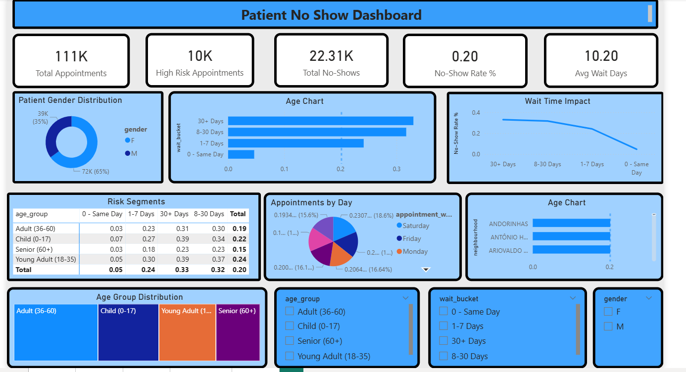

Here is the complete, corrected, and optimized **README.md** file for your GitHub repository. It ensures the image syntax is perfect, the project structure matches your actual filenames, and all markdown blocks are properly closed to ensure visibility.

---

# 🏥 Apollo Hospital: Appointment No-Show Prediction & Analysis

## 👋 Overview

Missed hospital appointments (no-shows) create significant financial losses and reduce operational efficiency for healthcare providers. This project analyzes more than **110,000 medical appointment records** from Apollo Hospital to identify the primary factors influencing patient absenteeism.

Using **SQL, Python, and Power BI**, the project transforms raw healthcare data into an interactive executive dashboard that delivers actionable insights to improve scheduling efficiency and increase patient attendance rates.

---

## 🚀 Key Features & Analysis

### 👥 Demographic Profiling

Analyzed appointment attendance trends across different age groups and genders to identify high-risk patient segments.

### ⏳ Wait Time Sensitivity

Measured how the number of days between booking and appointment dates impacts patient attendance behavior.

### 🩺 Chronic Condition Impact

Evaluated the relationship between chronic conditions such as Hypertension, Diabetes, and Alcoholism and appointment absenteeism.

### 📱 SMS Effectiveness

Compared attendance rates between patients who received SMS reminders and those who did not.

### 📍 Geospatial Analysis

Identified neighbourhoods with the highest no-show rates to uncover location-based risk patterns.

### 🗓️ Temporal Trends

Analyzed appointment attendance patterns across different days of the week to support efficient staff allocation and scheduling.

---

## 🛠️ Technical Toolkit

### SQL (MySQL)

Used for large-scale data engineering tasks, including timestamp normalization, data cleaning, and creation of analytical views.

### Python (Pandas & Seaborn)

Performed forensic data auditing, feature engineering, statistical analysis, and advanced visualizations such as risk heatmaps.

### Power BI

Developed an interactive dashboard with KPI cards, heatmaps, demographic filters, and executive-level reporting.

---

## ⚙️ Development Lifecycle

### Phase 1: Data Engineering (SQL)

* 
**Loading**: Parsed UTC timestamps, removed unnecessary suffixes, and standardized raw CSV column headers.


* 
**Cleaning**: Applied exclusion rules for invalid age values and corrupted records where appointment dates preceded booking dates.


* 
**Transformation**: Built SQL CASE logic to create Wait Buckets and Age Groups for simplified business analysis.


### Phase 2: Data Science (Python)

* 
**Audit**: Performed forensic analysis to detect missing values and data entry inconsistencies.


* 
**Calculation**: Calculated Wait Days using normalized date operations to replicate clinical scheduling metrics.


* 
**Visualization**: Created a Risk Matrix Heatmap to analyze the relationship between age groups and waiting periods.


### Phase 3: Business Intelligence (Power BI)

* 
**Modeling**: Designed a structured analytical model connecting demographics, health conditions, and appointment logistics.


* 
**Reporting**: Built an executive dashboard with drill-through analysis capabilities for detailed demographic exploration.


---

## 📈 Key Business Insights

* 
**📉 The Wait Time Paradox**: No-show rates increase dramatically from nearly 0% for same-day appointments to more than 30% for patients waiting over 30 days.


* 
**👨‍⚕️ Age Sensitivity**: Young adults aged 18–35 represent the highest-risk group for absenteeism, while senior citizens aged 60+ demonstrate the highest attendance consistency.


* 
**📲 The SMS Paradox**: Although SMS reminders target high-risk patients effectively, reminder notifications alone are insufficient to significantly reduce absenteeism rates.


* 
**📍 Geospatial Clusters**: Certain neighbourhoods exhibit higher no-show rates, suggesting a connection between accessibility, travel distance, and patient attendance.


---

## 📂 Project Structure

```text
Hospital-NoShow-Analysis/
├── 01_Loading.sql                # Database setup & timestamp normalization
├── 02_Cleaning.sql               # Data cleaning & exclusion logic
├── 03_Analysis.sql               # Analytical SQL queries
├── 04_Views.sql                  # BI-ready production views
├── Apolloi_Analysis.ipynb        # Python analysis & visualization notebook
├── Apollo_Analysis.pbix          # Interactive Power BI dashboard
├── patient_no_show_dashboard.png # Dashboard preview image
└── README.md                     # Project documentation

```

---

## 📊 Dashboard Preview

---

## 🤝 Connect

* 💼 **LinkedIn**: [linkedin.com/in/nitishkumar-khavekar](https://www.google.com/search?q=https://linkedin.com/in/nitishkumar-khavekar)
* 💻 **GitHub**: [github.com/Nitishkumarkhavekar](https://www.google.com/search?q=https://github.com/Nitishkumarkhavekar)
